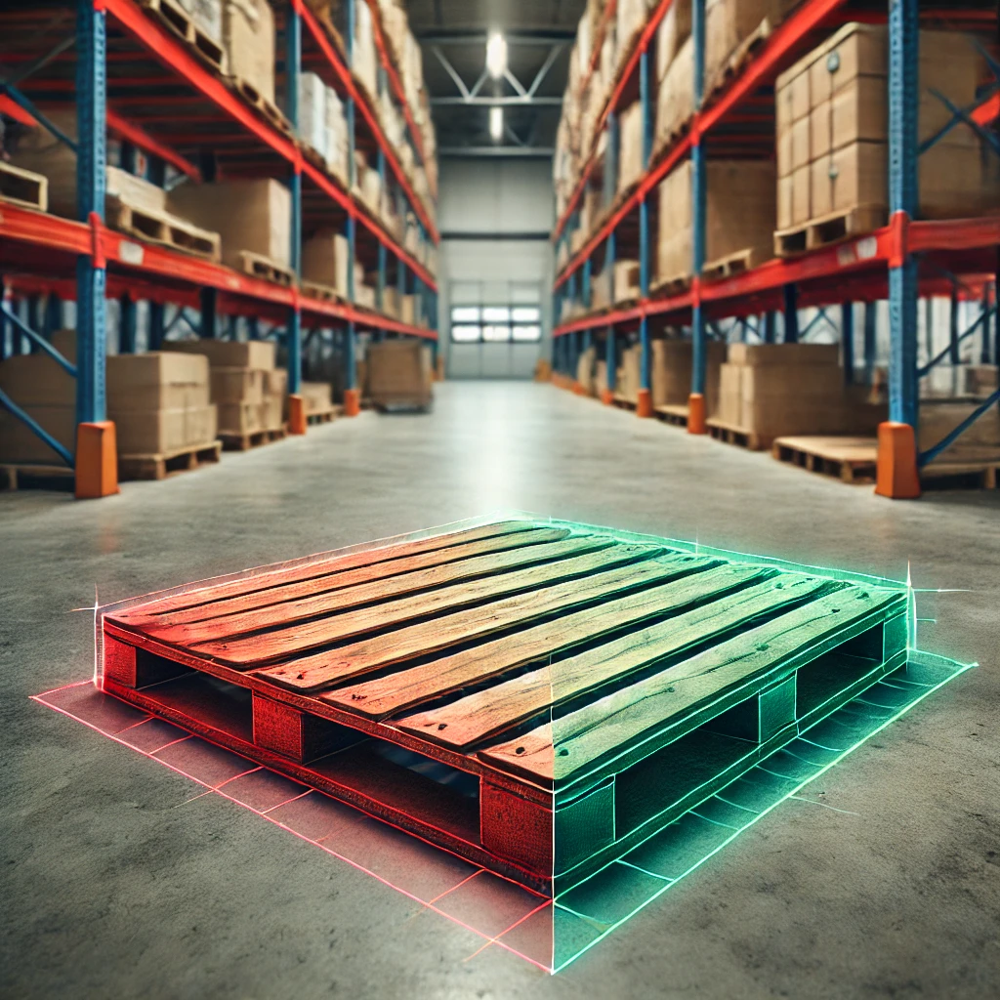

<a name="readme-top"></a>


<!-- PROJECT SHIELDS -->
[![Contributors][contributors-shield]][contributors-url]
[![Forks][forks-shield]][forks-url]
[![Stargazers][stars-shield]][stars-url]
[![Issues][issues-shield]][issues-url]
[![MIT License][license-shield]][license-url]
[![LinkedIn][linkedin-shield]][linkedin-url]


<!-- PROJECT LOGO -->
<br />
<div align="center">
  <a href="https://github.com/trushant05/pallet_insight_ros2">
    
  </a>

  <h3 align="center">Pallet Insight ROS2</h3>

  <p align="center">
    <br />
    <a href="https://trushant05.github.io/pallet_insight_ros2/"><strong>Explore the docs »</strong></a>
    <br />
    <br />
    <a href="https://github.com/trushant05/pallet_insight_ros2">View Demo</a>
    ·
    <a href="https://github.com/trushant05/pallet_insight_ros2/issues">Report Bug</a>
    ·
    <a href="https://github.com/trushant05/pallet_insight_ros2/issues">Request Feature</a>
  </p>
</div>


<!-- TABLE OF CONTENTS -->
<details>
  <summary>Table of Contents</summary>
  <ol>
    <li>
      <a href="#about-the-project">About The Project</a>
      <ul>
        <li><a href="#built-with">Built With</a></li>
      </ul>
    </li>
    <li>
      <a href="#getting-started">Getting Started</a>
    </li>
    <li><a href="#usage">Usage</a></li>
    <li><a href="#contact">Contact</a></li>
    <li><a href="#acknowledgments">Acknowledgments</a></li>
  </ol>
</details>


<!-- ABOUT THE PROJECT -->
## About The Project

Pallet Insight ROS2 is a pallet detection and segmentation ROS2 package designed for real-time pallet identification in warehouse environments. This solution primarily uses RGB images, with optional parameters to incorporate depth images for enhanced model performance. The entire pipeline is optimized for edge devices, specifically the NVIDIA Jetson Orin ecosystem, to support mobile robotic applications.

<p align="right">(<a href="#readme-top">back to top</a>)</p>


### Built With

Tech stack for Pallet Insight ROS2 package:
* Python
* ROS 2
* TensorRT

<p align="right">(<a href="#readme-top">back to top</a>)</p>


<!-- GETTING STARTED -->
## Getting Started

Pull the pallet_insight latest docker image from Docker Hub:
```
docker pull trushant99/pallet_insight:latest
```

<!-- USAGE EXAMPLES -->
## Usage

Use docker compose file in Docker directory to run the ROS2 node:
```
docker compose up
```

Note: The above script by default will run docker container with a dummy publisher,
if you have external image topics, change the entrypoint from default (entrypoint.sh) to external_data.sh.

_For more examples, please refer to the [Documentation](https://trushant05.github.io/pallet_insight_ros2/)_

<p align="right">(<a href="#readme-top">back to top</a>)</p>


<!-- CONTACT -->
## Contact

Trushant Adeshara - trushant@umich.edu

Project Link: [Pallet Insight ROS2](https://github.com/trushant05/pallet_insight_ros2)

<p align="right">(<a href="#readme-top">back to top</a>)</p>


<!-- ACKNOWLEDGMENTS -->
## Acknowledgments

Following resources were very helpful in developing Pallet Insight ROS2 Package:

* [Ultralytics YOLO11](https://docs.ultralytics.com/models/yolo11/)
* [Roboflow](https://roboflow.com/)
* [TensorRT](https://github.com/NVIDIA/TensorRT)
* [Yolo ROS](https://github.com/mgonzs13/yolo_ros)


<p align="right">(<a href="#readme-top">back to top</a>)</p>


<!-- MARKDOWN LINKS & IMAGES -->
<!-- https://www.markdownguide.org/basic-syntax/#reference-style-links -->
[contributors-shield]: https://img.shields.io/github/contributors/trushant05/pallet_insight_ros2.svg?style=for-the-badge
[contributors-url]: https://github.com/trushant05/pallet_insight_ros2/graphs/contributors
[forks-shield]: https://img.shields.io/github/forks/trushant05/pallet_insight_ros2.svg?style=for-the-badge
[forks-url]: https://github.com/trushant05/pallet_insight_ros2/forks
[stars-shield]: https://img.shields.io/github/stars/trushant05/pallet_insight_ros2.svg?style=for-the-badge
[stars-url]: https://github.com/trushant05/pallet_insight_ros2/stargazers
[issues-shield]: https://img.shields.io/github/issues/trushant05/pallet_insight_ros2.svg?style=for-the-badge
[issues-url]: https://github.com/trushant05/pallet_insight_ros2/issues
[license-shield]: https://img.shields.io/github/license/trushant05/pallet_insight_ros2.svg?style=for-the-badge
[license-url]: https://github.com/trushant05/pallet_insight_ros2/blob/main/LICENSE.txt
[linkedin-shield]: https://img.shields.io/badge/-LinkedIn-black.svg?style=for-the-badge&logo=linkedin&colorB=555
[linkedin-url]: https://linkedin.com/in/trushant-adeshara/
[product-screenshot]: images/screenshot.jpeg


## Reference
This README.md file was inspired from work of [othneildrew](https://github.com/othneildrew/Best-README-Template).
