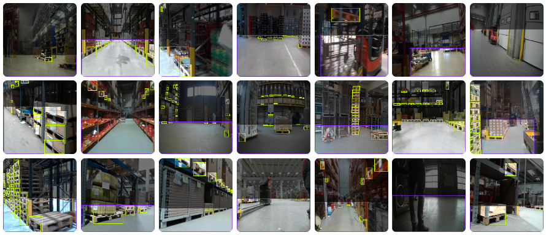

# Dataset Acquisition and Preparation

## Step 1: Annotate Dataset

The Pallet Dataset contains 519 images, which were annotated as the first step. To expedite the labeling process, I used auto-labeling with Grounding DINO, integrated directly in Roboflow, which significantly improved efficiency.

Note: While Grounding DINO performed well in identifying the ground, it encountered challenges in accurately labeling pallets. It often inferred both the pallet and the payload as a single entity.

## Step 2: Dataset Split

For the initial testing phase, the dataset was split as follows:

- Training: 70%
- Validation: 20%
- Testing: 10%

Note: In the future, we aim to implement k-fold cross-validation for more robust model evaluation.

## Step 3: Data Augmentation

Using the dataset export feature, the 519 images were augmented with the following parameter variations:

- Saturation: Between -25% to +25%
- Brightness: Between -25% to +25%
- Exposure: Between -15% to +15%

Note: These ranges were set to the maximum permissible limits before Roboflow suggested adjustments, to establish a baseline model. Future enhancements may involve additional augmentation to improve model robustness.

## Step 4: Final Dataset for Training

- Training set: 1092
- Validation set: 103
- Test set: 52 

