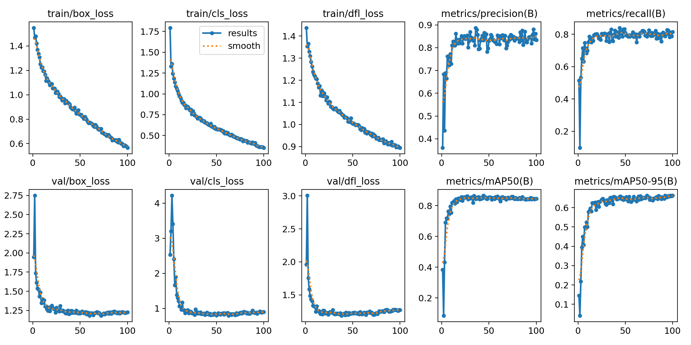
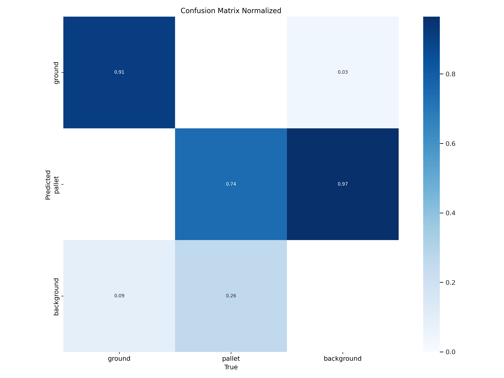

# Object Detection and Semantic Segmentation

## Object Detection Model

Currently, the model used for detecting pallets and ground is YOLOv11. This model was chosen due to its balance between performance and efficiency. Despite utilizing fewer parameters, it achieves a commendable mAP (mean Average Precision) score, making it a suitable choice for edge computing devices like Jetson Orin boards. Additionally, its architecture is easier to optimize and quantize, which is critical for resource-constrained environments.

## Model Selection
The YOLOv11 model is available in multiple sizes. Considering the requirements for edge deployment, I selected the small and medium-sized variants, as they offer an optimal trade-off between accuracy and computational efficiency.

Below are the training and validation results for both model sizes:

### 1. YOLOv11-Small:

  <figure>
      
      <figcaption>Figure 1: Training Result (100 epoch)</figcaption>
  </figure>
  
  

  <figure>
      
      <figcaption>Figure 2: Training Confusion Matrix Normalized</figcaption>
  </figure>
  <figure>
      
      <figcaption>Figure 3: Validation Confusion Matrix Normalized</figcaption>
  </figure>
  

### 2. YOLOv11-Medium:

  <figure>
      
      <figcaption>Figure 4: Training Result (100 epoch)</figcaption>
  </figure>

  

  <figure>
      
      <figcaption>Figure 5: Training Confusion Matrix Normalized</figcaption>
  </figure>
  <figure>
      
      <figcaption>Figure 6: Validation Confusion Matrix Normalized</figcaption>
  </figure>

Note: The results shown above pertain to the YOLOv11 small and medium-sized models trained for 100 epochs. For a comprehensive analysis, including results from both 50-epoch and 100-epoch training, refer to the full results.

Download the complete result: [(YOLOv11s-50ep)](./assets/files/YOLOv11_s_50ep.zip) [(YOLOv11s-100ep)](./assets/files/YOLOv11_s_100ep.zip) [(YOLOv11m-50ep)](./assets/files/YOLOv11_m_50ep.zip) [(YOLOv11m-100ep)](./assets/files/YOLOv11_m_100ep.zip)

